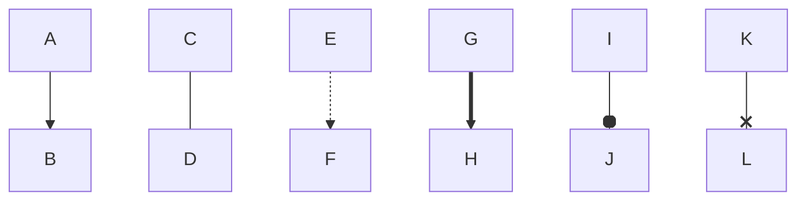

# PlantUML
![Диаграмма классов](https://www.plantuml.com/plantuml/png/SoWkIImgAStDKRWmvSAE2nikRBxO02Jt0E46XGkxBko-iE5YuyN62_ikREBYIiv9B2vMS4uiKgZcKb18pi_9BmBIkVafgJb0MXjib8OcaAbSL9e7OHINv1S0MRLSN21jDZMw2awbnM2sbcvAVdcUha98Pb4gYe1hNdfcNYeNK9r2FbJ8fIYpBBM8YyiXDIy5w5O0 "Диаграмма классов"

# Заголовок 1

